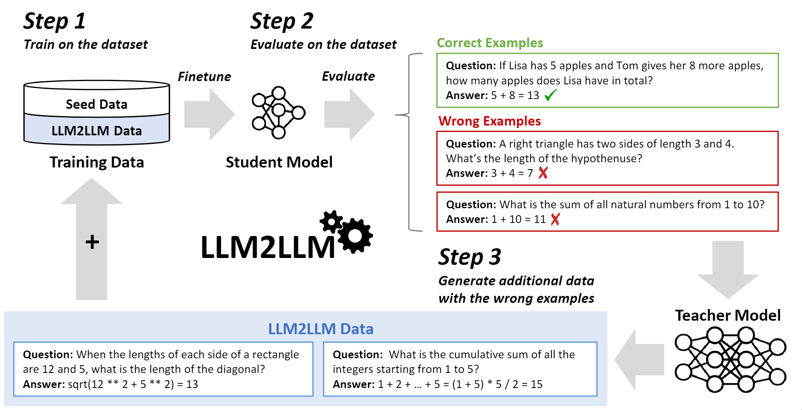

# LLM2LLM: Boosting LLMs with Novel Iterative Data Enhancement



This is the code for the LLM2LLM paper.

## Reproducing Main Experiments

We have provided code required to reproduce our main experiments for GSM8K. Instructions for other datasets will be uploaded soon.

1. Download a copy of LLaMA-2-7B, and the appropriate dataset
2. Clone the GSM8K dataset by running
```
cd GSM8K
git clone https://github.com/openai/grade-school-math.git
```
3. Run `generate_seed_data.py` and adjust `SUBSAMPLE_SPLIT` to get seed data.
4. Ensure that all settings in `config.yaml` are accurate
5. Run `python GSM8K/generator_data.py GSM8K/config.yaml`
6. `cd` into your experiment folder and run `./run_all.sh`
7. After all of the iterations have finished, run 
```
python report_results.py --results_file_name test_0.jsonl GSM8K/grade-school-math/grade_school_math/data/test.jsonl $EXP_FOLDER
```
to get a detailed breakdown of the performance of the model at each iteration.

This will produce an output folder that contains all the data and model checkpoints.

## Reproducing other experiments

We will upload this code soon.
